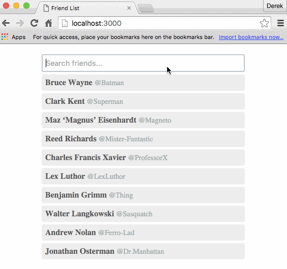

# Welcome to the Deedmob front end developer coding challenge!

Please make sure to read through this page thoroughly and understand what is expected (Every item in the Spec should work)

## Friend List

## The Problem

Create an app with a dynamic and search-able list of data that keeps a search input text query in sync with the URL via a query parameter at all times. Assume the data will be fetched from some API and the API will perform the actual search. The query should be a simple string and kept in sync with the URL via a query parameter 'q' (ex. localhost:3000/?q=batman).

This problem is harder than it first appears, actions must be managed in the correct order, and if not can result in infinite loops and other undesirable behavior.

## The Spec

#### Core Features (mandatory)

- Hit the API **once and only once** per query change (you can use api/index or your own implementation)
- When the query updates -> update the URL and fetch results from the API.
- When the URL updates -> update the query and fetch results from the API.
- The browser's back / forward buttons should keep the app state (query + results) in sync with the URL (this is a gotcha if not thought about carefully).

#### Bonus Features (optional)

- Handle the concurrent actions issue - "If the user changes the query input while there is still a pending request from a previous query change, the current pending request should be cancelled and a new request should be made."
- Debounce the fetching of results by 100ms.
- Log any state changing action with the newly changed state.
- Add loading and/or error states

## Rules

- You can use any technology you would like, however we use and prefer you to use react. A useful boilerplate for starting is either `create-react-app` or [react-code-challenge-boilerplate](https://github.com/mrharel/react-code-challenge-boilerplate)
- You can discuss this exercise with anyone you want, but please do not ask anyone to write or review your actual code.
- You can Google anything you need to.
- If you stumble upon someone else's solution to this exercise, please don't look at it or copy it.
- Because we may re-use this challenge with other engineering candidates, please don't fork this repo off Github or otherwise make your solution easily discoverable. You may submit your solution via zip file, patch, link to a private repo, or whatever else makes sense to you.

## Evaluation Criteria

- We don't expect you to be familiar with React, Redux or anything else in the boilerplate. We consider it a plus if you can complete this exercise using our stack, if you think you can do a better job using other tools (Flux, Ember, etc.), that's fine. Feel free to ask us if you have questions about how anything works.
- Asking questions is good. We will not penalize you for asking questions. In an actual work environment, we prefer that engineers spend 30 minutes talking a problem over with someone than spend an entire day building the wrong thing. Open issues to ask questions.
- We like code that is clean, well named, well organized and ideally testable.
- If you find this exercise too difficult or if you get stuck somewhere, feel free to talk to us. While we obviously prefer candidates who can hit the ground running, we're also willing to consider candidates who can, with some help, learn on the job.

## Submission

Please email us engineering@deedmob.com your submission, which includes your name, code, and a short description of what technologies you used and why, and also how and what you would improve about your solution if you had more time :)
